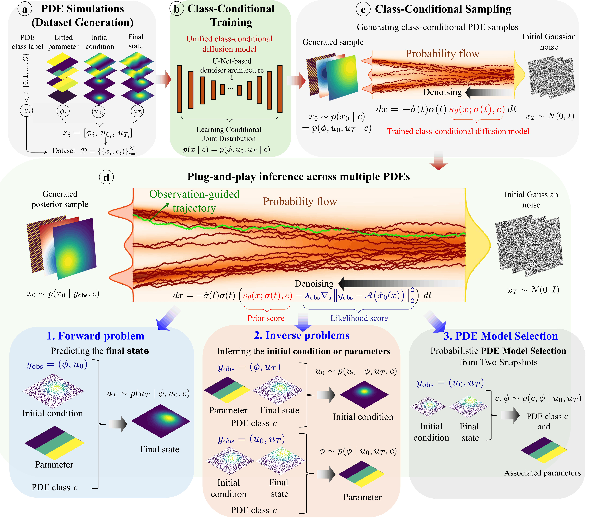

# pADAM: a plug-and-play all-in-one diffusion architecture for multi-physics learning

### [Paper](https://arxiv.org/abs/2603.16757) | [Data](https://doi.org/10.5281/zenodo.21940366)

Official PyTorch implementation of:

**pADAM: a plug-and-play all-in-one diffusion architecture for multi-physics learning**

Amirhossein Mollaali, Bongseok Kim, Christian Moya, Guang Lin

Purdue University

<p align="center">
  
</p>

<p align="center">
  <em>Schematic overview of pADAM.</em>
</p>

## Overview

pADAM is a unified generative approach for multi-physics learning across heterogeneous partial differential equation (PDE) families. A single shared diffusion model is used for multiple scientific inference tasks, including forward prediction, inverse reconstruction, parameter inference, and probabilistic governing-equation selection among predefined PDE classes. The model supports conditioning on both full and sparse observations without task-specific retraining.

## Data

Datasets supporting numerical experiments reported in this study are publicly
available in the Zenodo repository:

**[pADAM supporting datasets](https://doi.org/10.5281/zenodo.21940366)**


## Training


Training is performed with PyTorch and supports multi-GPU training using `torchrun`.

For example, the following command trains pADAM jointly on the three PDE classes
used in the *Navigating the continuous physics manifold* experiment of the paper:
diffusion, advection, and advection–diffusion, with varying physical parameters.

```bash
torchrun --standalone --nproc_per_node=2 train.py \
    --outdir=saved_models/var_params \
    --data=Data/var_params/train_data \
    --stats=Stats.yaml \
    --num_classes=3 \
    --exp=var_params \
    --arch=ddpmpp \
    --batch=64 \
    --batch-gpu=32 \
    --cond=1 \
    --tick=20 \
    --snap=20 \
    --dump=20 \
    --duration=20 \
    --ema=0.05

```
## Inference

The same trained pADAM model can be used for different inference tasks and PDE
classes through the corresponding conditioning settings.

The examples below illustrate forward prediction, inverse reconstruction, and
parameter estimation for the diffusion PDE class (`--typePDE=diffusion`).

### Forward prediction

Sample the final state from

$$
u_T \sim p(u_T \mid u_0, \phi, c).
$$

```bash
python3 generate_multi_pde_var_params.py \
    --config=configs/var_params.yaml \
    --offset=1 \
    --seed=1234 \
    --device_index=0 \
    --typePDE=diffusion \
    --Nobs=4096 \
    --TypeProblem=forward
```

### Inverse reconstruction

Sample the initial state from

$$
u_0 \sim p(u_0 \mid u_T, \phi, c).
$$

```bash
python3 generate_multi_pde_var_params.py \
    --config=configs/var_params.yaml \
    --offset=1 \
    --seed=1234 \
    --device_index=0 \
    --typePDE=diffusion \
    --Nobs=4096 \
    --TypeProblem=inverseu
```

### Parameter estimation

Sample the governing parameter from

$$
\phi \sim p(\phi \mid u_0, u_T, c).
$$

```bash
python3 generate_multi_pde_var_params.py \
    --config=configs/var_params.yaml \
    --offset=1 \
    --seed=1234 \
    --device_index=0 \
    --typePDE=diffusion \
    --Nobs=4096 \
    --TypeProblem=inversep
```


## Citation

If you use pADAM in your research, please cite:

```bibtex
@article{mollaali2026padam,
  title   = {pADAM: a plug-and-play all-in-one diffusion architecture for multi-physics learning},
  author  = {Mollaali, Amirhossein and Kim, Bongseok and Moya, Christian and Lin, Guang},
  journal = {arXiv preprint arXiv:2603.16757},
  year    = {2026}
}
```


## License

The training and inference implementation in this repository builds on and
extends the [DiffusionPDE](https://github.com/jhhuangchloe/DiffusionPDE)
codebase, which in turn builds on components from
[EDM](https://github.com/NVlabs/edm). These components have been extended
for pADAM to support unified multi-physics learning across heterogeneous PDE
families and the inference settings considered in the paper.

This repository is distributed under the Creative Commons
Attribution-NonCommercial-ShareAlike 4.0 International (CC BY-NC-SA 4.0)
license.

## Contact

For questions regarding the code or manuscript, please open an issue in this repository or contact the corresponding author.
